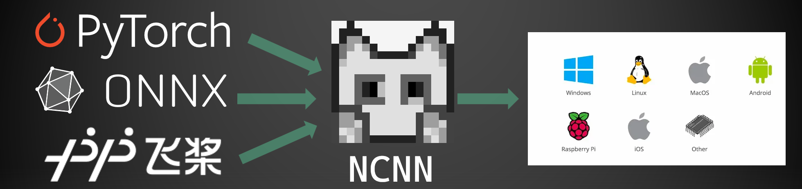

##  
 NCNN Models 

The collection of pre-trained AI models, and how they were converted, deployed. [中文](README-CN.md)

### About

The ncnn framework enables cross-device deployment with the help of the vulkan api. We pre-train models via pytorch, tensorflow, paddle etc. and then convert them to ncnn models for final deployment on Windows, mac, linux, android, ios, WebAssembly and uni-app. However, model conversion is not a one-click process and needs to be handled manually. In order to extend the boundary applications of ncnn, we have created this repository to receive any cases of successful or failed conversions.

### How to contribute

[Contribute tutorial](contribute.md)

	✅ : good to work
    ❌ : bad to work
    ⭕ : good to work, but not good to contribute
    ❓ : not sure
    🤔 : not sure, but good to contribute
    🤷 : not sure, but bad to contribute
    🤯 : not sure, but not good to contribute
### Failure Notes

> We believe we will succeed in the end.

| Model                                             | Year | From    | Code                                                                                  | Convert | IsWork | Desktop | Mobile | Wasm | Uni-app | loT  |
| :------------------------------------------------ | :--- | :------ | :------------------------------------------------------------------------------------ | :------ | :----- | :------ | :----- | :--- | :------ | :--- |
| [RVM](image_matting/RVM)                          | 2021 | Pytorch | [link](https://github.com/PeterL1n/RobustVideoMatting)                                | ❌       | ✅      | ✅       | ✅      |      |         |      |
| [deoldify](image_inpainting/deoldify)             | 2019 | Onnx    | [link](https://github.com/KeepGoing2019HaHa/AI-application)                           | ❌       | ✅      | 🤔       |        |      |         |      |
| [AnimeGanV3](style_transfer/animeganv3)           | 2022 | Onnx    | [link](https://github.com/TachibanaYoshino/AnimeGANv3)                                | ❌       |        |         |        |      |         |      |
| [HybridNets](objech_dection/hybridnets)           | 2022 | Pytorch | [link](https://github.com/datvuthanh/HybridNets)                                      | ❌       |        |         |        |      |         |      |
| [yolop](objech_dection/yolop)                     | 2021 | Pytorch | [link](https://github.com/hustvl/YOLOP)                                               | ❌       | 🤔      | ✅       | ✅      |      |         |      |
| [pfld](face_dection/pfld)                         | 2019 | Pytorch | [link](https://github.com/polarisZhao/PFLD-pytorch)                                   | ❌       | ✅      | ✅       | ✅      |      |         |      |
| [CaiT](image_classification/cait)                 | 2021 | Pytorch | [link](https://github.com/rwightman/pytorch-image-models/blob/master/docs/results.md) | ✅       | ❌      | ✅       |        |      |         |      |
| [yolox](objech_dection/yolox)                     | 2021 | Pytorch | [link](https://github.com/Megvii-BaseDetection/YOLOX)                                 | ✅       | ❌      |         | ✅      |      |         |      |
| [yolov5](objech_dection/yolov5)                   | 2021 | Pytorch | [link](https://github.com/ultralytics/yolov5)                                         | ⭕       | ✅      | ✅       | ✅      | ✅    | ✅       | ✅    |
| [AnimeGanV2](style_transfer/animeganv2)           | 2020 | Pytorch | [link](https://github.com/bryandlee/animegan2-pytorch)                                | ✅       | ✅      | ✅       | ✅      | 🤔    | 🤔       | ⭕    |
| [deeplabv3](image_matting/deeplabv3)              | 2017 | Pytorch | [link](https://pytorch.org/hub/pytorch_vision_deeplabv3_resnet101/)                   | ✅       | ✅      | ✅       | 🤔      | 🤔    | 🤔       |      |
| [DenseNet](image_classification/denseNet)         | 2018 | Pytorch | [link](https://pytorch.org/hub/pytorch_vision_densenet)                               | ✅       | ✅      | ✅       | 🤔      | 🤔    | 🤔       |      |
| [resnet18](image_classification/resnet18)         | 2015 | Pytorch | [link](https://pytorch.org/hub/pytorch_vision_resnet)                                 | ✅       | ✅      | ✅       | 🤔      | 🤔    | 🤔       |      |
| [mobilenet_v2](image_classification/mobilenet_v2) | 2019 | Pytorch | [link](https://pytorch.org/hub/pytorch_vision_mobilenet_v2/)                          | ✅       | ✅      | ✅       | 🤔      | 🤔    | 🤔       |      |
| [mobilenet_v3](image_classification/mobilenet_v3) | 2019 | Pytorch | [link](https://rwightman.github.io/pytorch-image-models/models/mobilenet-v3/)         | ✅       | ✅      | ✅       | 🤔      | 🤔    | 🤔       |      |
| [Res2Net](image_classification/res2net)           | 2021 | Pytorch | [link](https://rwightman.github.io/pytorch-image-models/models/res2net)               | ✅       | ✅      | ✅       |        |      |         |      |
| [Res2Next50](image_classification/res2next50)     | 2021 | Pytorch | [link](https://rwightman.github.io/pytorch-image-models/models/res2next/)             | ✅       | ✅      | ✅       |        |      |         |      |
| [nanodet](objech_dection/nanodet)                 | 2020 | Onnx    | [link](https://github.com/RangiLyu/nanodet)                                           | ✅       | ✅      | ✅       | ✅      | ✅    | 🤔       | 🤔    |
| [UltraFace](face_dection/ultraface)               | 2019 | Pytorch | [link](https://github.com/Linzaer/Ultra-Light-Fast-Generic-Face-Detector-1MB)         | ✅       | ✅      | ✅       | ✅      | ✅    | 🤔       | ✅    |
| [efficientnet](image_classification/efficientnet) | 2021 | Pytorch | [link](https://github.com/rwightman/pytorch-image-models/blob/master/docs/results.md) | ✅       | ✅      | ✅       |        |      |         |      |

### Action recognition

> need to be contribute

### Background removal

### Face detection

### Frame Interpolation

### Image classification

### Image segmentation

### Object detection

### Object tracking

### Style transfer

### Super resolution

### Text recognition

