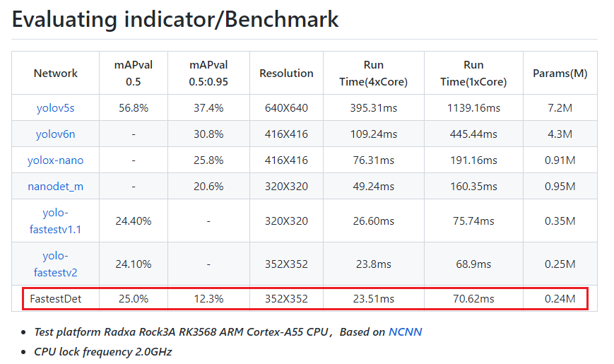

# FastestDet


## Input --> Output




## Convert 

pt --> TorchScript --> pnnx --> ncnn
```
git clone https://github.com/dog-qiuqiu/FastestDet.git # clone
cd FastestDet
pip install -r requirements.txt # install
# export models: pt 00> torchscript
python test.py --yaml configs/coco.yaml --weight weights/coco_ap05_0.250_280epoch.pth --img data/3.jpg --torchscript
# torchscript --> ncnn
pnnx yolov7.torchscript.pt inputshape=[1,3,352,352]

## 注意，crop算子计算有问题，最新的ncnn可能已修复，如果未修复，请使用已有的param文件替换你自己的即可使用。
# https://github.com/Tencent/ncnn/pull/3999
```

## Example project

## NCNN-MODELS

- [Download](https://github.com/Baiyuetribe/ncnn-models/releases/tag/models)

  
## Reference

- [dog-qiuqiu/FastestDet](https://github.com/dog-qiuqiu/FastestDet)


