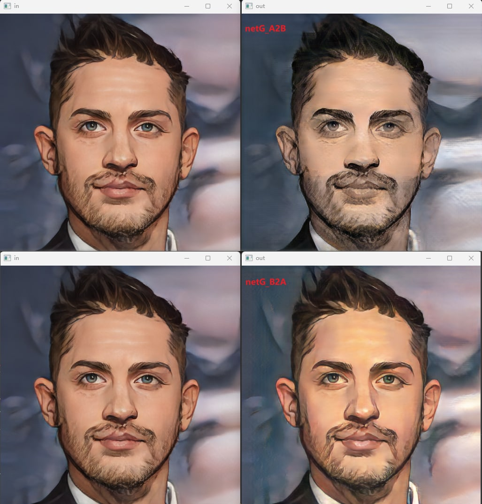

# Anime to Real

## Input --> Output



## Convert 

pt --> onnx --> onnx-sim --> onnx2ncnn ---> ncnnOptimize --> ncnn

```python
import os
import torch
from models import Generator, Discriminator

# Networks
netG_A2B = Generator(3, 3)  # 输入和输出的channnel数目
netG_B2A = Generator(3, 3)

# Load state dicts
netG_A2B.load_state_dict(torch.load("output/netG_A2B.pth"))  # 加载模型文件
netG_B2A.load_state_dict(torch.load("output/netG_B2A.pth"))  # 加载模型文件
# Set model's test mode
netG_A2B.eval()
netG_B2A.eval()

x = torch.randn(1, 3, 256, 256)
# ==== pnnx方法 提示 layer nn.InstanceNorm2d not exists or registered
# # # 1. pt --> torchscript
# traced_script_module = torch.jit.trace(netG_A2B, x, strict=False)
# traced_script_module.save("ts.pt")

# # # 2. ts --> pnnx --> ncnn
# os.system("pnnx ts.pt inputshape=[1,3,256,256]")    # 可能错误
# ==== onnx方法
torch.onnx._export(netG_B2A,    # 或netG_A2B
                   x,
                   "out.onnx",
                   export_params=True,
                   operator_export_type=torch.onnx.OperatorExportTypes.ONNX_ATEN_FALLBACK,
                   opset_version=13,
                   input_names=['in0'],
                   output_names=['out0'])
# 2. onnx --> onnxsim
os.system("python -m onnxsim out.onnx sim.onnx")

# 3. onnx --> ncnn
os.system("onnx2ncnn sim.onnx ncnn.param ncnn.bin")

# 4. ncnn --> optmize ---> ncnn
os.system("ncnnoptimize ncnn.param ncnn.bin opt.param opt.bin 1")  # 数字0 代表fp32 ；1代表fp16
os.remove("sim.onnx")

########################################################################
# 将该文件放在项目目录下，就可以完成转换
```

## Example project


## Reference

- [Averyyy/PyTorch-Anime2Real](https://github.com/Averyyy/PyTorch-Anime2Real)


