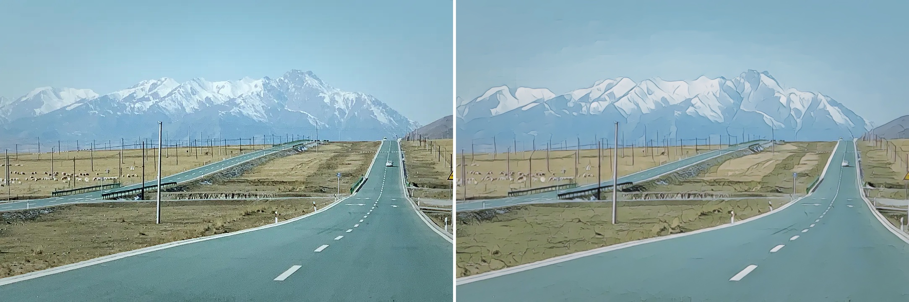

# AnimeGanV3

## Input --> Output



## Convert 

> 此模型当前仅有onnx，无法使用pnnx进行转换。

onnx --> simpleonnx --> onnx2ncnn[x] --> ncnnOptimize --> ncnn

在onnx2ncnn步骤失败，报错如下:
```
# step1: 
python -m onnxsim animeganv3_H64_model0.onnx sim.onnx --dynamic-input-shape
# step2:
onnx2ncnn.exe sim.onnx ncnn.param ncnn.bin
```
报错内容：
```log
Shape not supported yet!
Gather not supported yet!
Cast not supported yet!
  # to=6
Cast not supported yet!
  # to=7
Unknown data type 0
Shape not supported yet!
Gather not supported yet!
Cast not supported yet!
  # to=6
Unsupported squeeze axes !
Unsupported unsqueeze axes !
Unsupported squeeze axes !
```
解决办法： 手工优化
https://zhuanlan.zhihu.com/p/93017149

待测试


## Reference

- [TachibanaYoshino/AnimeGANv3](https://github.com/TachibanaYoshino/AnimeGANv3)


